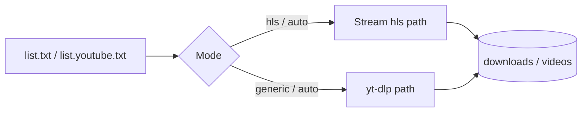

# HDL Flux

<p align="center">
  <strong>HDL Flux · Unified Downloader</strong><br>
  <sub>Rich CLI + PySide6 GUI · JSON config · Linux / Windows / macOS</sub>
</p>

<p align="center">
  
  
  
</p>

<p align="center">
  
</p>

---

## Apa ini?

CLI downloader modular untuk:

- **HStream path** (MPD/chunks, login Selenium, resume state)
- **Generic path** via **yt-dlp** (multi-site)
- UI interaktif berbasis **Rich**
- GUI desktop berbasis **PySide6**

Konfigurasi utama ada di JSON + env (`config.defaults.json`, `config.json`, `.env`/`HDL_*`).

---

## Fitur utama

| | |
|:---|:---|
| **Mode** | `auto` · `hstream` · `generic` — routing URL otomatis atau manual |
| **Config** | `config.defaults.json` + `config.json` (merge), opsi `HDL_*` & `.env` |
| **YouTube** | `config.youtube.json` + `list.youtube.txt` — folder & state terpisah |
| **Browser** | Default OS untuk Selenium & ekspor cookie yt-dlp |
| **Start cepat** | `start.sh` / `start.bat` — buat `.venv`, `pip install`, jalankan app |
| **GUI desktop** | `python gui.py` — mode `single/list`, progress tabel, speed/size per item |
| **Singlefile build** | `python build_singlefile.py` — hasil `dist/hdl-flux-cli` + `dist/hdl-flux-gui` |

---

## Quick start

### 1) Masuk ke folder proyek

```bash
cd HDL-Flux
```

### 2) Jalankan starter script (recommended)

**Linux / macOS**

```bash
chmod +x start.sh   # sekali saja
./start.sh
```

**Windows** (double-click atau CMD)

```bat
start.bat
```

Script akan:

1. Membuat **`.venv`** jika belum ada  
2. Menginstal **`requirements.txt`** (idempotent, cepat jika sudah lengkap)  
3. Menjalankan **`serve.py`**

### 2b) Jalankan GUI

```bash
python3 gui.py
```

Fitur GUI:

- Mode `single` / `list` (input tampil dinamis)
- Output folder custom (default ke folder `Downloads` OS)
- Tabel progress per URL: progress bar, size, speed, status
- Tab `Config JSON` (edit semua config langsung)
- Tab `Credentials` (edit `.credentials.json` langsung)
- Skip otomatis URL hstream yang file targetnya sudah ada (status: already downloaded)

### 3) Siapkan URL

- Default: salin **`list.txt.sample`** -> **`list.txt`**, isi satu URL per baris.
- YouTube-only: **`HDL_CONFIG=config.youtube.json`** dan gunakan **`list.youtube.txt`**.

---

## Prasyarat

| Kebutuhan | Keterangan |
|-----------|------------|
| **Python** | 3.10+ (`python3` / `python`) |
| **FFmpeg** | Wajib untuk remux / chunk → MP4 (mis. `pacman -S ffmpeg`, `apt install ffmpeg`, atau [ffmpeg.org](https://ffmpeg.org)) |
| **Browser + driver** | Untuk hstream login / Selenium — biasanya **Selenium Manager** membantu |

Dependensi Python: **`requirements.txt`** (`requests`, `rich`, `yt-dlp`, `selenium`).
Untuk GUI: `PySide6`.

---

## Menjalankan manual

```bash
python3 -m venv .venv
source .venv/bin/activate          # fish: source .venv/bin/activate.fish
# Windows: .venv\Scripts\activate
pip install -r requirements.txt
python3 serve.py
```

Profil YouTube:

```bash
HDL_CONFIG=config.youtube.json python3 serve.py
```

---

## File config (ringkas)

| File | Peran |
|------|--------|
| **`config.defaults.json`** | Template bawaan; **jangan dihapus** |
| **`config.json`** | Dibuat otomatis saat pertama jalan (salinan default); edit di sini |
| **`config.youtube.json`** | Overlay YouTube-only; pakai dengan `HDL_CONFIG` |
| **`.env`** | Variabel opsional (lihat **`.env.example`**) |
| **`HDL_*`** | Override dari environment, mis. `HDL_CONFIG`, `HDL_PROXY_DEFAULT_URL` |

Detail kunci JSON ada di dalam **`config.defaults.json`** (`ui`, `hstream`, `generic`, `strings`, `browser_detection`, …).


## Struktur module

Core sekarang dipisah agar mudah maintain:

- `serve.py`: entrypoint tipis
- `hdl/app.py`: orchestration flow + UI session
- `hdl/config.py`: loading/merge config + env override
- `hdl/browser.py`: browser detection, selenium driver, cookie export
- `hdl/hstream.py`: HStream downloader + ffmpeg convert (CPU/CUDA auto)
- `hdl/generic_downloader.py`: generic yt-dlp pipeline
- `hdl/routing.py`: URL classify + skip-existing checks
- `hdl/state_manager.py`: state/resume handling
- `hdl/gui.py`: desktop GUI runner + worker pipeline

## Build singlefile executable

Build lokal (current OS):

```bash
python3 build_singlefile.py
```

Output:

- `dist/hdl-flux-cli` (atau `.exe`)
- `dist/hdl-flux-gui` (atau `.exe`)

Auto release GitHub:

- Workflow: `.github/workflows/release-singlefile.yml`
- Trigger otomatis saat push tag `v*` (contoh `v1.0.0`)
- Assets release: paket singlefile Linux / Windows / macOS

## Screenshot GUI

Simpan screenshot di folder `screenshot/`, lalu referensikan di README.
Contoh (aktifkan jika file sudah ada):

```md

```

## Alur singkat



---

## Tips

- **Proxy SOCKS5** default bisa diaktifkan lewat prompt atau config (`proxy.default_url`).  
- **Cookie** untuk situs generik: export browser atau `cookies.txt` — semua label prompt di config.  
- **Resume** hls: state di file yang diatur di `paths.state_file` (beda file untuk profil YouTube).
- **CUDA/NVIDIA**: HStream ffmpeg mendukung mode `auto/cpu/cuda` (jika encoder NVENC tersedia, `auto` akan pakai GPU lalu fallback ke CPU jika gagal runtime).

---

## Public repository checklist

Sebelum push ke public:

- Jangan commit file sensitif (`.env`, `.credentials.json`, cookie files, local state).
- Pastikan `config.json` tidak berisi path private/token.
- Gunakan sample files untuk berbagi setup (`.env.example`, `list.txt.sample`).
- Rotate credential jika pernah sempat ter-commit.

---

## Lisensi & tanggung jawab

Gunakan alat ini hanya untuk konten yang **Anda punya hak** aksesnya. Penulis tidak bertanggung jawab atas penyalahgunaan.

---

<p align="center">
  <sub>Dibuat untuk workflow unduhan yang rapi: satu repo, satu config, satu perintah.</sub>
</p>
